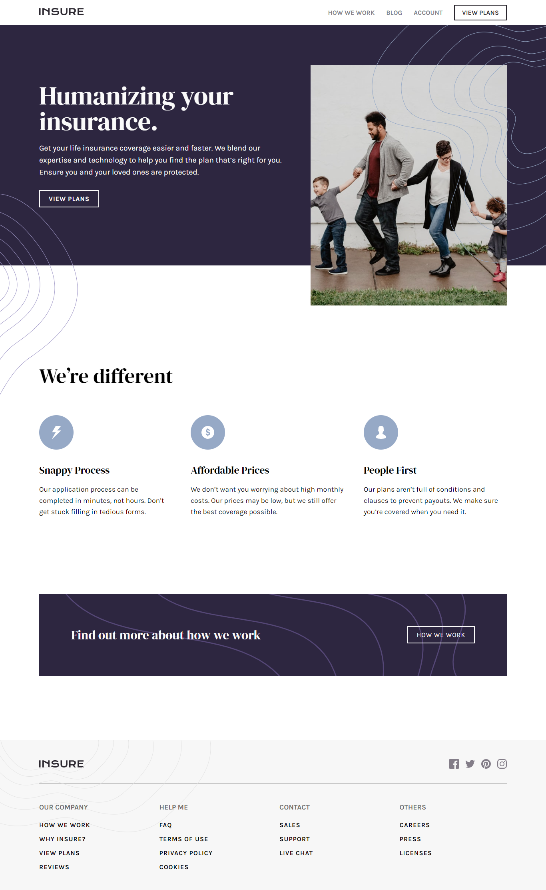
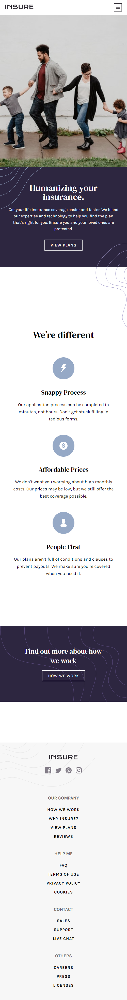

# Frontend Mentor - Insure landing page solution

This is a solution to the [Insure landing page challenge on Frontend Mentor](https://www.frontendmentor.io/challenges/insure-landing-page-uTU68JV8). Frontend Mentor challenges help you improve your coding skills by building realistic projects.

## Table of contents

- [Overview](#overview)
  - [Screenshot](#screenshot)
- [My process](#my-process)
  - [Built with](#built-with)
  - [What I learned](#what-i-learned)
  - [Useful resources](#useful-resources)
- [Author](#author)

## Overview

### Screenshot

#### Desktop View

#### Mobile View

## My process

### Built with

- HTML5
- CSS Custom Properties
- Flexbox
- CSS Grid
- SASS
- JavaScript
- AOS(Animate on Scroll) js library

### What I learned

I learned more when it comes to CSS layouts especially the positioning, flexbox, and basic grid layout. I also learned how to build a navbar with pure css and javascript.

### Useful resources

- [CSS Tricks](https://css-tricks.com/) - This helped me understand more about CSS.
- [W3schools](https://www.w3schools.com/) - This is an amazing website for web development it gives you the proper syntax on how to build something and W3schools provide a lot of examples when it comes to web development.
- [AOS js](https://github.com/michalsnik/aos) - A javascript and css library for smooth animations when scrolling the website.

## Author

- Website - [John Martin De Guia](https://jmartindeguia.netlify.app/)
- Frontend Mentor - [@jmartindg](https://www.frontendmentor.io/profile/jmartindg)
